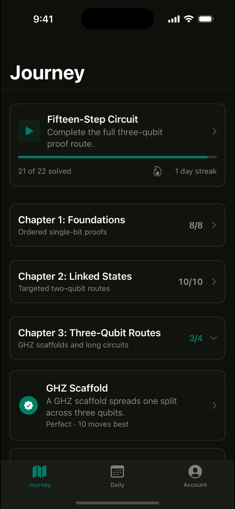
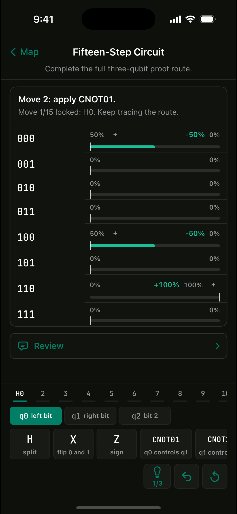
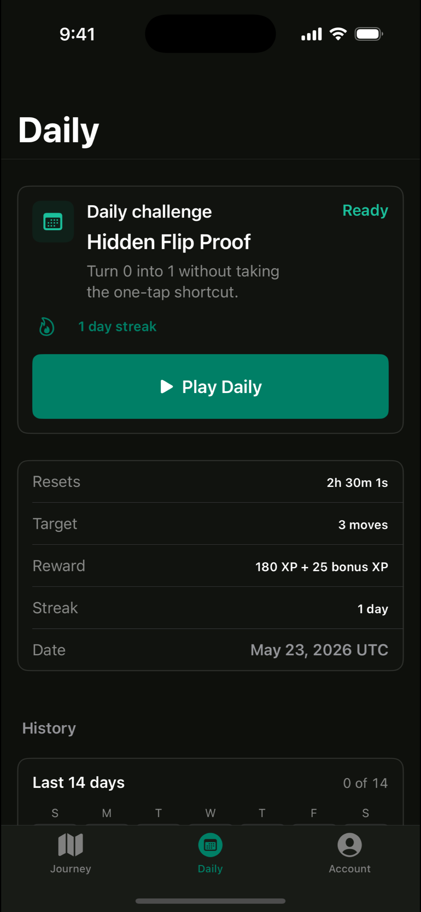
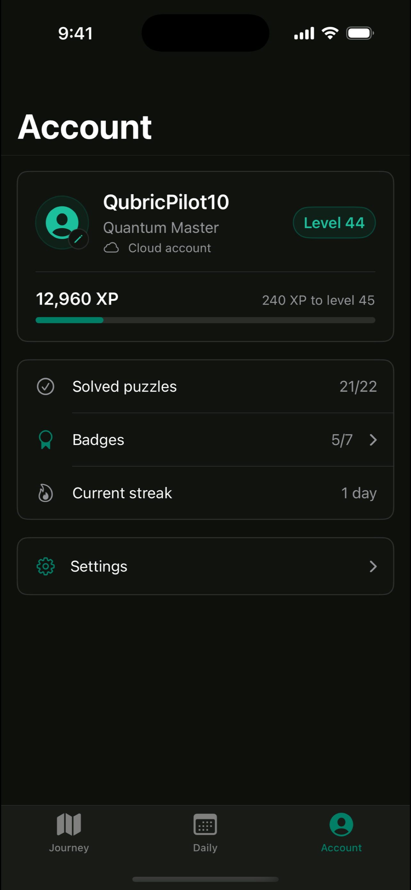

# Qubric

[](https://apps.apple.com/us/app/qubric/id6772515889)
[](https://github.com/YTomar79/qubric/actions/workflows/ci.yml)


<p align="center">
  
  &nbsp;
  
  &nbsp;
  
  &nbsp;
  
</p>

Qubric is an educational quantum puzzle game for iOS. Players solve hands-on puzzles backed by a real state-vector simulator, progressing through a chapter-based journey and a rotating daily challenge.

**[Download Qubric on the App Store →](https://apps.apple.com/us/app/qubric/id6772515889)**

## Features

- **Interactive puzzles** — assemble solutions from a palette of operations and run them against a live simulator.
- **Quantum engine** — a from-scratch state-vector simulator built on complex amplitudes, gate application, and measurement.
- **Journey progression** — chapters and levels that unlock as you advance, with XP, streaks, and per-puzzle stats.
- **Daily challenge** — a fresh puzzle each day with its own history.
- **Cloud accounts** — username/password sign-in with progress synced across devices.
- **Privacy-first** — no location, camera, photos, contacts, microphone, or tracking access; in-app account deletion.

## Requirements

- Xcode 15 or later
- iOS 17.0+
- Swift 5

## Install

```bash
git clone https://github.com/YTomar79/qubric.git
cd qubric
open Qubric.xcodeproj
```

Select the `Qubric` scheme and run on a simulator or device.

## Quick check (build)

```bash
xcodebuild build \
  -project Qubric.xcodeproj \
  -scheme Qubric \
  -destination 'platform=iOS Simulator,name=iPhone 16'
```

## Test

```bash
xcodebuild test \
  -project Qubric.xcodeproj \
  -scheme Qubric \
  -destination 'platform=iOS Simulator,name=iPhone 16' \
  CODE_SIGNING_ALLOWED=NO
```

The `QubricTests` target covers the quantum engine: complex arithmetic, state resolution, gate application, and derived measurements. CI runs the same build and test on every push and pull request.

## Dependencies

None. Qubric uses only first-party Apple frameworks (SwiftUI, Foundation, AVFoundation, UserNotifications). There is no package manager step.

## Configuration

The app resolves its backend URL in the following order:

1. `QUBRIC_API_URL` environment variable (useful for local development).
2. The bundled `QubricAPIURL` value from `Info.plist`.
3. `http://127.0.0.1:3000` as a local fallback.

Set `QUBRIC_API_URL` in the Xcode scheme or your build settings to point at your own backend. The value in source control is a placeholder and should be replaced with your deployment.

## Project Structure

```
.
├── Qubric/                    App sources
│   ├── QubricApp.swift            App entry point and global appearance
│   ├── ContentView.swift          Root tab navigation
│   ├── JourneyView.swift          Chapter map and progression
│   ├── DailyView.swift            Daily challenge flow
│   ├── AccountView.swift          Account, settings, and data controls
│   ├── AuthView.swift             Sign-in and account creation
│   ├── QubricStore.swift          Central app state and persistence
│   ├── QubricAPIClient.swift      Networking layer
│   ├── QubricModels.swift         Core data models
│   ├── QubricQuantumEngine.swift  State-vector simulator
│   ├── QubricTheme.swift          Design tokens
│   ├── QubricComponents.swift     Shared UI components
│   └── Puzzle/                    Puzzle screen and its subviews
├── QubricTests/               Unit tests
└── .github/workflows/ci.yml   Continuous integration
```

## Privacy

Qubric requests only optional notification permission and includes an in-app account deletion flow. It does not collect location, camera, photos, contacts, or microphone data, and contains no tracking or user-generated content surfaces.

## License

Released under the [MIT License](LICENSE).
